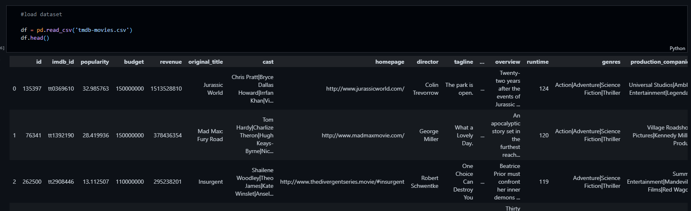
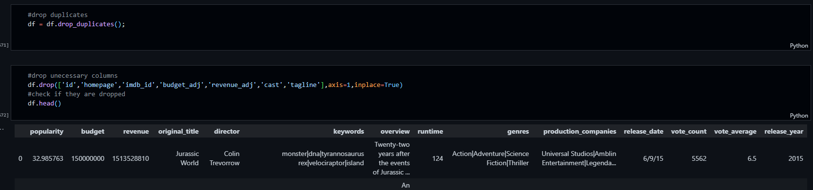
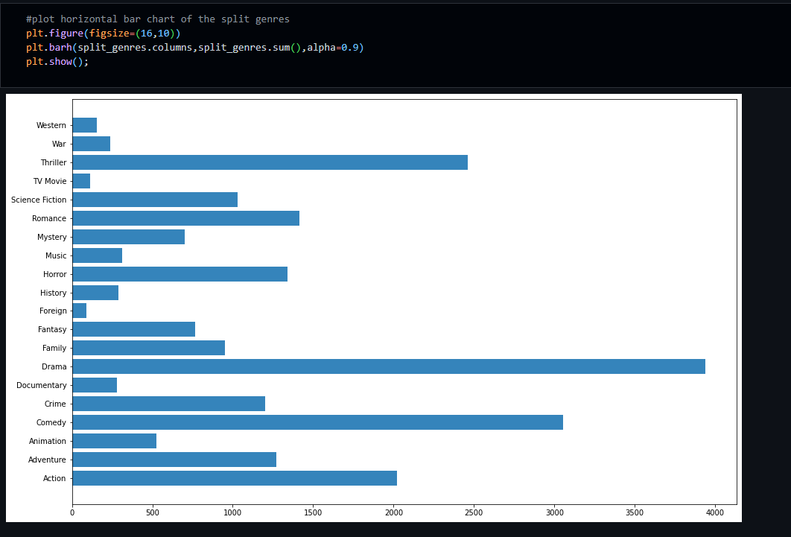

# investigation a tmdb-movie dataset

This dataset contain 10,876 dataset of tmd-movies, with 21 features. the picture below is the first 3 data of the dataset

The data is somehow messy and dirty which make it difficult to work on it . Since there is no choice then we have to explore the data in other to clean the messy and dirty data using data wrangling .All the features that are not needed in the project where drop while all the columns that have np data were fixed using pandas fillna function.

After cleaning the dataset then , the next thing is to explore the dataset and point out some insight from the information gathered. while exploring the dataset i find 8 in teresting question that i was curious about , then i go on with the exploration and visualize all question before i conclude my research below are the questions and there corresoponding visualization.

**Q1. Which genres are the most popular from year to year ?**

**Drama** is the most popular genres

##### From the above graph it is clear that there are 5 most popular genres and they are listed below according to there rank

* Drama
* Comedy
* Thriller
* Action
* Romance

**Note: i won't be showing all the questions here , if you want to see the remaining qestion open the investigation_a_Dataset.ipynb**

Thank you.
